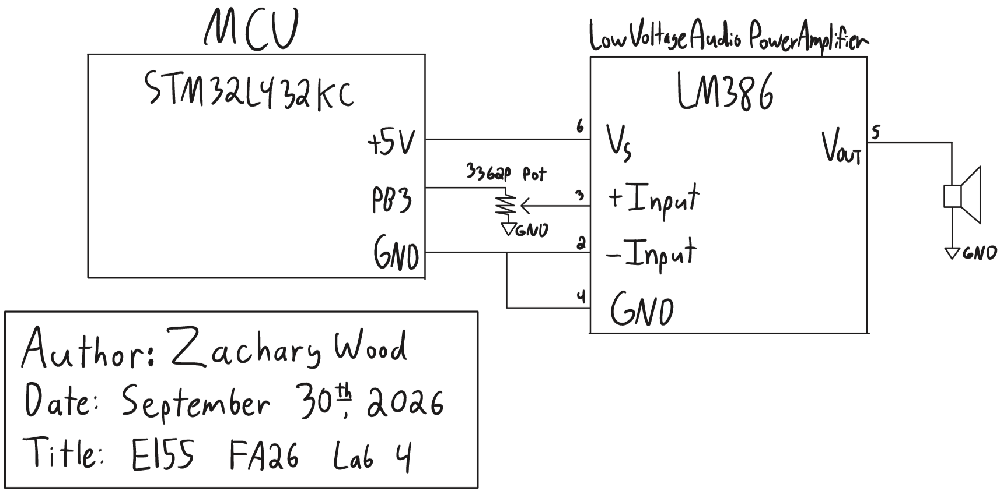

## Introduction

The goal of this lab was to play music on a speaker with the STM32L432KC microcontroller. I wrote a driver for the MCU's basic timers from the reference manual (RM0394) and used two of them to generate square waves on a GPIO pin from a list of frequency and duration pairs. The pin drives an LM386 audio amplifier through a volume potentiometer, and the design plays Fur Elise and John Dowland's *Tarleton's Jig*.

## Design and Testing Methodology

### MCU Implementation

The design builds on the flash, GPIO, and RCC libraries from the course's [clock configuration tutorial](https://github.com/HMC-E155/tutorial-clock-configuration). `configureFlash()` sets four flash wait states, and `configureClock()` configures the PLL to multiply the 4 MHz MSI oscillator by 80 and divide it by 4, producing an 80 MHz system clock. The AHB and APB prescalers are left at their reset value of 1, so the timers are also clocked at 80 MHz. I fixed one bug in the tutorial's GPIO library: `digitalWrite()` ignored its `val` argument and always set the pin high, so it now clears the pin when `val` is 0.

I wrote a new library, `STM32L432KC_TIMER`, for the basic timers TIM6 and TIM7. Following the tutorial's format, its header defines each timer's base address, a register struct laid out from the TIM6/TIM7 register map in RM0394 (Section 29.4.9) with reserved padding for unused offsets, and macros for the CEN, UIF, and UG bits. Each function takes a pointer to either timer:

| Function | Operation |
|---|---|
| `initTimer` | Writes the prescaler (PSC) and forces an update event so that it takes effect |
| `startTimer` | Sets the period (ARR = ticks - 1), resets the counter, clears UIF, and enables the counter |
| `stopTimer` | Disables the counter |
| `checkUpdateFlag` | Returns the update interrupt flag (UIF), which hardware sets each time the counter rolls over |
| `clearUpdateFlag` | Clears UIF |

PSC is buffered, so a new value only takes effect at the next update event. The driver forces one by setting the UG bit, which also sets UIF, so the flag is cleared immediately afterward.

I chose TIM6 and TIM7 because they are the simplest timers on the MCU and have identical register layouts, so one struct and one set of functions serves both. They have no output channels to drive a pin directly, so the square wave is generated in software by polling the timers and toggling the pin.

`main` (`lab4_zw.c`) enables the GPIOB, TIM6, and TIM7 clocks, configures PB3 as an output, and prescales both timers to 1 MHz. For each note, `playNote()` runs a polling loop with both timers:

- TIM6 repeats every half period of the note. Each time its UIF is set, the loop clears it and toggles PB3.
- TIM7 repeats every 1 ms. The loop counts its rollovers and ends the note after the specified number of milliseconds.
- For a rest, TIM6 is never started and PB3 stays low. After every note, both timers stop and PB3 is driven low.

Because both timers auto-reload in hardware, a delay in the loop's response shifts a single edge but does not accumulate. `playSong()` plays notes until it reaches a duration of 0, and `main` plays Fur Elise, pauses for 1 s, plays the second song, and then idles.

PB3 also drives LED D5 on the development board, so the LED lights during notes and turns off during rests. PB3's switch on DIP switch SW7 is left off so that the FPGA is not connected to the pin.

### Hardware

PB3 drives one end of a $10\text{ k}\Omega$ 3362P potentiometer whose other end is grounded, so the wiper outputs an adjustable fraction of the 3.3 V square wave. The wiper drives the noninverting input (pin 3) of an LM386 audio amplifier, whose inverting input (pin 2) is grounded. Pins 1 and 8 are left open, which sets the gain to 20 (26 dB), and the amplifier is powered from the development board's 5V rail. The output (pin 5) drives the $8\ \Omega$ speaker directly. As the lab permits, the output coupling capacitor and the $0.05\ \mu\text{F}$ and $10\ \Omega$ network from the datasheet's example circuit were omitted.

The potentiometer sets the volume, and it also keeps pin 3 within the LM386's absolute maximum input of $\pm 0.4$ V, which the 3.3 V GPIO signal would otherwise exceed.

### Extra Composition

The second song is the melody line of John Dowland's *Tarleton's Jig* (also known as *Tarleton's Willy*), transcribed from a [ukulele arrangement](https://renaissance-ukukele.blogspot.com/2020/10/dowland-tarletons-jig-or-tarletons-willy.html) in 6/8 time. I used an eighth note of 300 ms. Pitches are frequencies rounded to the nearest hertz. Consecutive repeated notes would otherwise merge into one continuous tone, so I shortened the first of each pair by 50 ms and inserted a 50 ms rest.

### Testing

I first verified the square wave on PB3 with an oscilloscope, checking the pitch and duration of the first notes and that the pin stayed low during rests. I then built the amplifier circuit and checked its output with an $8\ \Omega$ dummy load, following the speaker protection procedure, before connecting the speaker. Finally, I played both songs to verify the pitches, tempo, rests, and volume control.

## Technical Documentation

The source code for the project can be found in the associated [Github repository](https://github.com/wood-zachary/hmc-e155-portfolio/tree/main/labs/lab4).

### Schematic

Figure 1 shows the schematic of the physical circuit. On-board components, including the Nucleo-L432KC and LED D5, are documented in the [development board schematic](https://hmc-e155.github.io/assets/doc/E155%20Development%20Board%20Schematic.pdf).

#### Calculations

**Timer clock.** Both timers are clocked at $f_{TIM} = 80$ MHz and use a prescaler of $PSC = 79$:

$$f_{CNT} = \frac{f_{TIM}}{PSC + 1} = \frac{80\text{ MHz}}{80} = 1\text{ MHz}$$

Each counter tick therefore lasts $1\ \mu\text{s}$, and a timer with auto-reload value $ARR$ rolls over and sets UIF every $ARR + 1$ ticks.

**Pitch.** PB3 toggles on every TIM6 rollover, so one period of the square wave spans two rollovers. For a note of frequency $f$, the code sets $ARR = N - 1$, where $N$ is the half period in ticks rounded to the nearest integer:

$$N = \text{round}\left(\frac{f_{CNT}}{2f}\right), \qquad f_{out} = \frac{f_{CNT}}{2N}$$

The code performs the rounding in integer arithmetic as `(1000000 + f) / (2 * f)`.

**Duration.** TIM7 uses $ARR = 999$, so it rolls over every

$$T = \frac{ARR + 1}{f_{CNT}} = \frac{1000}{1\text{ MHz}} = 1\text{ ms}$$

and a note of $d$ ms ends after $d$ rollovers.

**220 Hz and 1000 Hz.** For 220 Hz:

$$\frac{f_{CNT}}{2f} = \frac{10^6}{440} = 2272.73 \;\Rightarrow\; N = 2273, \quad ARR = 2272$$

$$f_{out} = \frac{10^6}{2(2273)} = 219.974\text{ Hz}, \qquad \text{error} = \frac{|219.974 - 220|}{220} = 0.012\%$$

For 1000 Hz, $10^6/2000 = 500$ exactly, so $N = 500$ and $f_{out} = 1000$ Hz with no error. Both pitches are within 1%.

**Accuracy bound.** Since $f_{out}/f = N_{exact}/N$, where $N_{exact} = f_{CNT}/2f$, and rounding changes the count by at most half a tick, the relative error is

$$\epsilon = \frac{|N_{exact} - N|}{N} \le \frac{0.5}{N}$$

The error is therefore at most 1% whenever $N \ge 50$, which holds for every frequency up to 10 kHz.

**Frequency range.** ARR is 16 bits, so $N \le 65536$, and the lowest frequency is

$$f_{min} = \frac{10^6}{2(65536)} = 7.63\text{ Hz}$$

Since pitches are integers, the lowest playable pitch is 8 Hz ($N = 62500$), and the code plays lower pitches as silence rather than overflowing ARR. The highest frequency guaranteed to be within 1% is 10 kHz ($N = 50$). The hardware limit is $N = 1$, or 500 kHz.

**Duration range.** Durations have a resolution of 1 ms, so the shortest note is 1 ms. The elapsed milliseconds are counted in an `int` rather than in ARR, so the longest note is $2^{31} - 1$ ms, about 24.9 days. A duration of 0 ends the song.

These calculations assume an exact 80 MHz clock. Any deviation in the MSI oscillator's frequency scales every pitch and duration by the same factor.

**Fur Elise.** Fur Elise's pitches range from 262 Hz to 1319 Hz. Its highest note has the fewest ticks per half period, $N = 379$, so by the accuracy bound every note's error is at most $0.5/379 = 0.13\%$, well within 1%.

Checking only 220 Hz and 1000 Hz is not sufficient on its own. The error does not vary smoothly with frequency (1000 Hz is exact only because $10^6/2000$ is an integer), and Fur Elise's highest note, 1319 Hz, is above both test frequencies, where $N$ is smaller and the error bound is larger.

## Results and Discussion

The design meets all of the lab's proficiency and excellence requirements. It plays Fur Elise with the correct pitches, tempo, and rests, plays *Tarleton's Jig* as an extra composition, and the potentiometer adjusts the volume. The timers are accessed through memory-mapped registers defined with `#define` macros and a register struct, and rests never reach the half-period calculation, so the code never divides by zero.

The main limitation of the design is that the CPU busy-waits in the polling loop for the entire song. TIM2, whose channel 2 is available on PB3 through alternate function AF1, could generate the square wave in hardware with PWM, and an update interrupt could replace the duration polling, which would leave the CPU free during each note.

## Conclusion

The design played Fur Elise and *Tarleton's Jig* on a speaker using a timer driver written from the reference manual, with two basic timers setting the pitch and duration of each note.

::: {.callout-note collapse="true"}
## Hours spent (click to expand)
I spent 16 hours on this lab. For instructor reference, I spent 3 hours reviewing the lab materials and slides (I missed three lectures due to sickness and injury), 2 hours planning the lab, 1 hour drawing my schematic, 3 hours coding, 2 hours working on and debugging hardware, and 5 hours writing the lab report and completing the AI prototype (ChatGPT gives very long answers).
:::

## AI Prototype Summary

The purpose of this AI Prototype is to test whether an LLM can act as a documentation search assistant, navigating the reference manual and datasheet to choose and configure a peripheral.

::: {.callout-tip collapse="true"}
## Prompt 1 (ChatGPT, anonymous session)
What timers should I use on the STM32L432KC to generate frequencies ranging from 220Hz to 1kHz? What's the best choice of timer if I want to easily connect it to a GPIO pin? What formulae are relevant, and what registers need to be set to configure them properly?
:::

::: {.callout-tip collapse="true"}
## Prompt 2 (RM0394 attached)
I attached `rm0394.pdf`, and ChatGPT replied:

> I see you've uploaded RM0394, the STM32L4 reference manual. I can use it to pin down the timer, clock-tree, GPIO alternate-function, and register details from the actual reference manual rather than relying on generic STM32 information.
>
> For example, the manual's contents place the timer-clock configuration in Section 6.2.14, GPIO alternate-function mapping in Section 8.3.2/Section 8.3.11, and the timer peripherals/interconnections in the later timer chapters.
>
> If you want, I can now go through RM0394 and give you a corrected, register-by-register TIM15/TIM16 or TIM2 configuration for the L432KC, including the exact register bit fields and the relevant page/section references.

I then asked:

Give me a corrected, register-by-register TIM15/TIM16 or TIM2 configuration for the L432KC
:::

I ran this prototype in an anonymous ChatGPT session because Claude rejected the reference manual's file size. I asked the prompt first without any documents, then attached RM0394 and asked for a corrected, register-by-register configuration.

I would rate the output as useful for orientation but unreliable in its details. A single answer named the timers with output channels, gave the formulas relating PSC and ARR to the output frequency, and listed the registers to configure, which would have taken me much longer to assemble from the reference manual, the datasheet, and the board manual. However, a few of its specific values were wrong, including a frequency calculation and a missing register setting.

Attaching the reference manual did not make the answer more accurate. The second response cited section numbers and added register settings, but its one explicit correction changed a correct alternate-function number to an incorrect one. The per-pin alternate-function table appears only in the datasheet, so the attached manual could not have supported the change, which shows that giving an LLM a document does not ensure that it answers from that document.

The LLM generated register-level C code, but the code used CMSIS definitions, which this lab prohibits, and it only produced a tone with no way to time notes or play rests. Also, because the prompt asked for an easy connection to a GPIO pin, it recommended TIM16 with hardware PWM, while I chose the basic timers TIM6 and TIM7 because their register layouts allow for just one driver, and toggling the pin in software met the lab's requirements.

Overall, the LLM works better as a documentation search assistant than as an HDL generator. A pointer to a section or a formula is quick to verify, while the HDL prototypes in lab 3 had to be read and tested to find their problems. To use it effectively, I would state the lab and board constraints in the prompt, ask it to name the document and table behind each value, and use its answers to decide where to look, taking the final values from the documents themselves.
