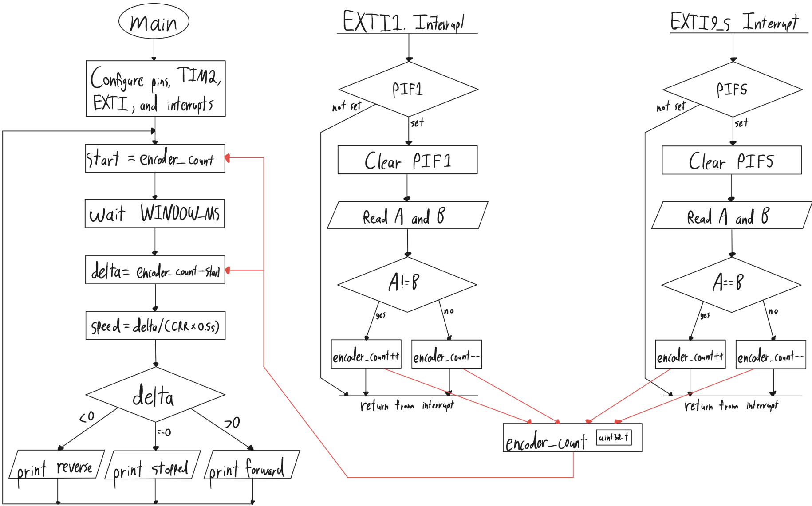
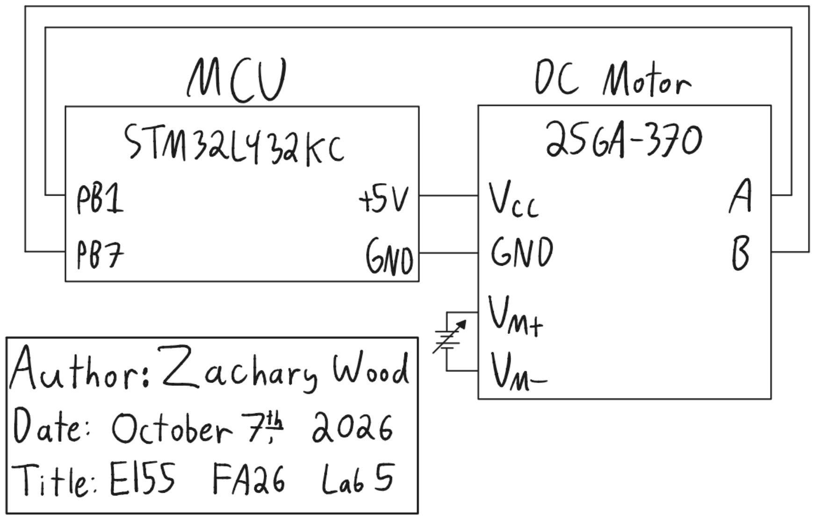

## Introduction

The goal of this lab was to measure the angular velocity and direction of a brushed DC motor with the STM32L432KC. The MCU decodes the motor's quadrature encoder with interrupts on both edges of both channels and prints the direction and speed to the debug terminal twice per second.

## Design and Testing Methodology

### MCU Implementation

The design builds on the GPIO, RCC, flash, and timer libraries from the course's interrupt tutorial. I fixed one bug in the timer library: `delay_millis()` set ARR to the requested delay, but the counter rolls over after ARR + 1 ticks, so every delay lasted 1 ms too long. It now sets ARR = ms - 1.

I wrote a new library, `STM32L432KC_EXTI`, with one function, `extiEnableEdges(pin, irq)`. It enables the SYSCFG clock, routes the pin to its EXTI line in SYSCFG_EXTICRx, unmasks the line in EXTI_IMR1, enables both the rising and falling triggers in EXTI_RTSR1 and EXTI_FTSR1, and enables the line's interrupt in the NVIC.

EXTI line *n* can only be driven by pin *n* of one port, so the two encoder channels must use different pin numbers. Encoder A is on PB1 (EXTI1, handled by `EXTI1_IRQHandler`) and encoder B is on PB5 (EXTI5, handled by `EXTI9_5_IRQHandler`).

Each handler clears its pending flag, reads both channels, and increments or decrements a shared `volatile` counter. Forward rotation steps (A, B) through 00, 10, 11, 01, so after an edge on A the two channels differ (A != B), and after an edge on B they match (A == B). Reverse rotation produces the opposite result, so:

| Handler | Forward (count up) | Reverse (count down) |
|---|---|---|
| `EXTI1_IRQHandler` (A changed) | A != B | A == B |
| `EXTI9_5_IRQHandler` (B changed) | A == B | A != B |

The handlers do no timing or arithmetic. The main loop records the encoder counter, waits 500 ms with TIM2, and takes the difference in the encoder counter. The encoder counter is a free-running `uint32_t`, so the unsigned difference is exact across wraparound, and casting it to `int32_t` gives the signed net count. The sign is the direction, and a stopped motor gives a difference of zero, meaning the motor is stopped.

Figure 1 shows the main loop and both interrupt handlers. They communicate only through `encoder_count` (red arrows).



### Hardware

The encoder is powered from the development board's 5 V rail, and its A and B outputs connect directly to PB1 and PB5. Both pins are 5 V tolerant (FT) according to Table 14 of the STM32L432KC datasheet and are not connected to pins that are not 5 V tolerant according to UM1956 Table 8. The internal pull resistors are left disabled, because Table 57 of the datasheet requires them to be disabled when a pin is held above V_DD + 0.3 V. The motor is powered by an external bench supply.

### Testing

<!-- TODO -->

## Technical Documentation

The source code for the project can be found in the associated [Github repository](https://github.com/wood-zachary/hmc-e155-portfolio/tree/main/labs/lab5).

### Schematic

Figure 2 shows the schematic of the physical circuit. On-board components, including the Nucleo-L432KC, are documented in the [development board schematic](https://hmc-e155.github.io/assets/doc/E155%20Development%20Board%20Schematic.pdf).



#### Calculations

**Resolution.** The encoder produces 408 pulses per channel per revolution. Counting both edges of both channels gives

$$CPR = 4 \times 408 = 1632 \text{ counts/rev}$$

**Velocity.** With $\Delta$ net counts in a window of $T = 0.5$ s,

$$\omega = \frac{\Delta}{CPR \cdot T} \text{ rev/s}$$

One count is the smallest measurable change, so the resolution, and the lowest non-zero speed the design reports, is

$$\omega_{min} = \frac{1}{1632 \times 0.5\text{ s}} = 1.23 \times 10^{-3}\text{ rev/s}$$

**Update rate.** Each loop takes the 0.5 s window plus the time to print, so the display updates at just under 2 Hz, above the required 1 Hz.

**Expected reading.** At the motor's rated 2.5 rev/s, the expected count per window is

$$\Delta = 2.5 \times 1632 \times 0.5 = 2040$$

and edges arrive every $1/(2.5 \times 1632) = 245\ \mu\text{s}$ on average.

<!-- TODO: measured speed at 12 V vs. 2.5 rev/s -->

### Interrupts vs. Polling

A polling design must sample both channels at least once between consecutive edges or else it would miss transitions. At 2.5 revolutions per second, that interval averages $245\ \mu\text{s}$, and it shrinks in proportion to speed. Any work in the polling loop, such as a call to `printf`, adds to the sampling interval, so the loop either misses edges at high speed or cannot do anything else.

With interrupts, the hardware latches each edge in EXTI_PR1 as soon as it occurs, and the main loop is free to block in a delay or print. An edge is only lost if a second edge on the same line arrives before the handler clears the first, so the maximum speed is set by the handler's duration rather than by the main loop.

## Results and Discussion

<!-- TODO -->

## Conclusion

The design measured the speed and direction of a DC motor by counting both edges of both encoder channels with interrupts, using an EXTI driver written from the reference manual.

::: {.callout-note collapse="true"}
## Hours spent (click to expand)
I spent 10 hours on this lab: 2 hours reviewing the lecture and manuals, 4 hours coding, 2 hours debugging hardware, and 2 hours writing the report and completing the AI prototype.
:::

## AI Prototype Summary

The purpose of this AI prototype is to test whether an LLM can write correct interrupt-driven embedded C.

::: {.callout-tip collapse="true"}
## Prompt (Claude Opus 5.5, incognito, medium effort)
Write me interrupt handlers to interface with a quadrature encoder. I'm using the STM32L432KC, what pins should I connect the encoder to in order to allow it to easily trigger the interrupts?
:::

The LLM recommended PA0 and PA1 because they are on EXTI lines 0 and 1, which have their own handlers, and are on the same port, so one read of GPIOA->IDR captures both channels. It also listed pins on the Nucleo board to avoid, including PA5 and PA6, which are tied to PB7 and PB6 through solder bridges.

Its decoder reads both channels on every edge and looks up the count change in a 16-entry state table indexed by the previous and current states. Transitions in which both channels change at once are counted as errors. It enabled the internal pull-ups and noted that 5 V encoder outputs require checking the pins' I/O structure or using a level shifter. It also suggested TIM2's hardware encoder mode as the standard alternative for motor encoders.

::: {.callout-tip collapse="true"}
## Generated interrupt code
```c
#include <stdint.h>
#include "stm32l4xx.h"

#define ENC_A_PIN           0U
#define ENC_B_PIN           1U
#define ENC_IRQ_PRIORITY    1U

static volatile int32_t  encoder_count;
static volatile uint32_t encoder_errors;
static uint32_t          encoder_state;

static const int8_t encoder_table[16] = {
     0, -1,  1,  0,
     1,  0,  0, -1,
    -1,  0,  0,  1,
     0,  1, -1,  0
};

static inline uint32_t encoder_read_state(void)
{
    uint32_t idr = GPIOA->IDR;
    uint32_t a = (idr >> ENC_A_PIN) & 1U;
    uint32_t b = (idr >> ENC_B_PIN) & 1U;

    return (a << 1) | b;
}

static void encoder_update(void)
{
    uint32_t next = encoder_read_state();
    int8_t delta = encoder_table[(encoder_state << 2) | next];

    if (delta != 0) {
        encoder_count += delta;
    } else if (next != encoder_state) {
        encoder_errors++;
    }

    encoder_state = next;
}

void encoder_init(void)
{
    RCC->AHB2ENR |= RCC_AHB2ENR_GPIOAEN;
    RCC->APB2ENR |= RCC_APB2ENR_SYSCFGEN;
    (void)RCC->APB2ENR;

    GPIOA->MODER &= ~(GPIO_MODER_MODE0_Msk | GPIO_MODER_MODE1_Msk);
    GPIOA->PUPDR = (GPIOA->PUPDR
                    & ~(GPIO_PUPDR_PUPD0_Msk | GPIO_PUPDR_PUPD1_Msk))
                   | GPIO_PUPDR_PUPD0_0 | GPIO_PUPDR_PUPD1_0;

    SYSCFG->EXTICR[0] &= ~(SYSCFG_EXTICR1_EXTI0_Msk
                           | SYSCFG_EXTICR1_EXTI1_Msk);

    EXTI->RTSR1 |= EXTI_RTSR1_RT0 | EXTI_RTSR1_RT1;
    EXTI->FTSR1 |= EXTI_FTSR1_FT0 | EXTI_FTSR1_FT1;
    EXTI->IMR1  |= EXTI_IMR1_IM0  | EXTI_IMR1_IM1;
    EXTI->PR1    = EXTI_PR1_PIF0  | EXTI_PR1_PIF1;

    encoder_state  = encoder_read_state();
    encoder_count  = 0;
    encoder_errors = 0;

    NVIC_SetPriority(EXTI0_IRQn, ENC_IRQ_PRIORITY);
    NVIC_SetPriority(EXTI1_IRQn, ENC_IRQ_PRIORITY);
    NVIC_ClearPendingIRQ(EXTI0_IRQn);
    NVIC_ClearPendingIRQ(EXTI1_IRQn);
    NVIC_EnableIRQ(EXTI0_IRQn);
    NVIC_EnableIRQ(EXTI1_IRQn);
}

void EXTI0_IRQHandler(void)
{
    EXTI->PR1 = EXTI_PR1_PIF0;
    encoder_update();
}

void EXTI1_IRQHandler(void)
{
    EXTI->PR1 = EXTI_PR1_PIF1;
    encoder_update();
}

int32_t encoder_get_count(void)
{
    return encoder_count;
}

uint32_t encoder_get_errors(void)
{
    return encoder_errors;
}
```
:::

::: {.callout-tip collapse="true"}
## Generated timer encoder mode code
```c
void encoder_timer_init(void)
{
    RCC->AHB2ENR  |= RCC_AHB2ENR_GPIOAEN;
    RCC->APB1ENR1 |= RCC_APB1ENR1_TIM2EN;
    (void)RCC->APB1ENR1;

    GPIOA->MODER = (GPIOA->MODER
                    & ~(GPIO_MODER_MODE0_Msk | GPIO_MODER_MODE1_Msk))
                   | GPIO_MODER_MODE0_1 | GPIO_MODER_MODE1_1;
    GPIOA->AFR[0] = (GPIOA->AFR[0]
                     & ~(GPIO_AFRL_AFSEL0_Msk | GPIO_AFRL_AFSEL1_Msk))
                    | (1U << GPIO_AFRL_AFSEL0_Pos)
                    | (1U << GPIO_AFRL_AFSEL1_Pos);
    GPIOA->PUPDR = (GPIOA->PUPDR
                    & ~(GPIO_PUPDR_PUPD0_Msk | GPIO_PUPDR_PUPD1_Msk))
                   | GPIO_PUPDR_PUPD0_0 | GPIO_PUPDR_PUPD1_0;

    TIM2->CR1   = 0;
    TIM2->CCMR1 = TIM_CCMR1_CC1S_0 | TIM_CCMR1_CC2S_0
                  | (3U << TIM_CCMR1_IC1F_Pos)
                  | (3U << TIM_CCMR1_IC2F_Pos);
    TIM2->CCER  = 0;
    TIM2->SMCR  = TIM_SMCR_SMS_0 | TIM_SMCR_SMS_1;
    TIM2->ARR   = 0xFFFFFFFFU;
    TIM2->CNT   = 0;
    TIM2->CR1   = TIM_CR1_CEN;
}

int32_t encoder_timer_get_count(void)
{
    return (int32_t)TIM2->CNT;
}
```
:::

<!-- TODO: plug the generated interrupt code in on hardware. Does it run, and how does it compare with my design? -->

<!-- TODO: short reflection on the quality of the output -->
